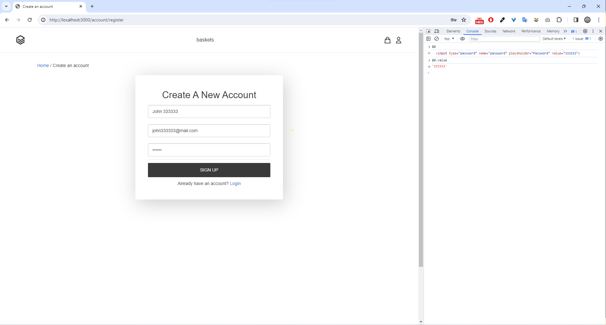
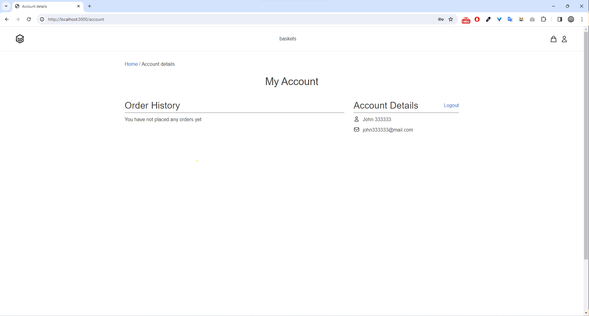
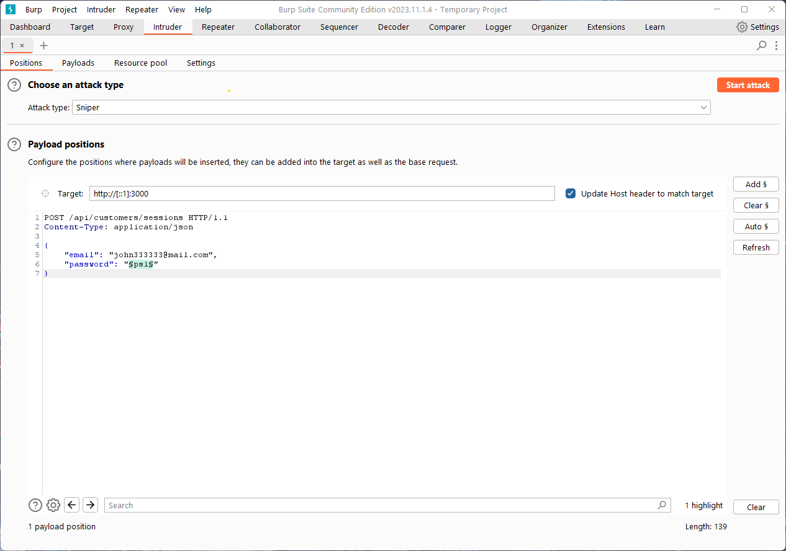
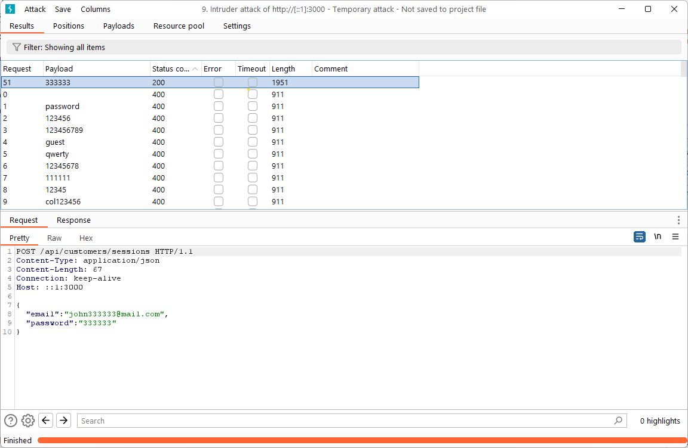

# Test 1 Report

## Conducting the test

1. In Shopmost application register customer with following credentials:
   - Full Name: `John 333333`
   - Email: `john333333@mail.com`
   - Password: `333333`
1. In Burp Suite go to `Intruder` > `Positions` tab.
1. In `Positions` tab:
   - Set `Attack type` to `Sniper`.
   - Set `Target` to `http://[::1]:3000` (localhost or 127.0.0.1 won't work).
   - In the request textfield paste the following content:
        ```txt
        POST /api/customers/sessions HTTP/1.1
        Content-Type: application/json

        {
            "email": "john333333@mail.com",
            "password": "§ps1§"
        }
        ```
1. Click `Start attack` button and wait for the attack to finish.
1. You should see that the request with password `333333` was successful.

## Results

### Register customer



### Customer dashboard after successful registration



### Prepare test



### Test results


